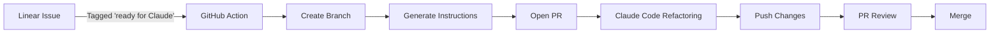

# Linear + Claude Code Integration Setup

This repository includes an automated workflow that bridges Linear project management with Claude Code for intelligent code refactoring.

## 🚀 Quick Start

### Prerequisites
- Linear account with API access
- GitHub repository with Actions enabled
- Claude Code for performing refactoring

### Step 1: Configure Secrets

Add these secrets to your GitHub repository (Settings → Secrets → Actions):

```bash
LINEAR_API_KEY=lin_api_xxxxxxxxxxxxx
SLACK_WEBHOOK_URL=https://hooks.slack.com/services/xxx (optional)
```

### Step 2: Create Linear Label

In Linear:
1. Go to Settings → Labels
2. Create label: `Ready for Claude` (case-sensitive!)
3. Use a distinctive color (recommended: purple 💜)

### Step 3: Test the Integration

1. Create a Linear issue:
   ```
   Title: Refactor Todo model for better performance
   
   Description:
   - Optimize database queries
   - Add proper indexing
   - Implement caching
   
   Label: Ready for Claude
   ```

2. The workflow will:
   - Detect the issue (runs hourly or on manual trigger)
   - Create a new branch
   - Generate refactoring instructions
   - Open a PR with all details

3. In Claude Code:
   - Pull the branch
   - Review instructions
   - Perform refactoring
   - Push changes

## 📋 Workflow Overview



## 🎯 Use Cases

### 1. Technical Debt Reduction
```markdown
Title: Remove code duplication in controllers

Description:
Several controllers have similar authentication logic that should be extracted into a concern.

Files affected:
- app/controllers/todos_controller.rb
- app/controllers/users_controller.rb

Goal: Extract common authentication code into a reusable concern
```

### 2. Performance Optimization
```markdown
Title: Optimize N+1 queries in TodosController

Description:
The index action is making multiple database queries. Need to add eager loading.

Current issues:
- Loading user for each todo separately
- Loading tags without includes
- No query caching

Expected outcome:
- Single query with proper includes
- Implement Russian doll caching
```

### 3. Code Quality Improvements
```markdown
Title: Refactor Todo model - extract complex scopes

Description:
The Todo model has become too complex with many interrelated scopes.

Tasks:
- Extract query objects for complex searches
- Simplify scope definitions
- Add proper documentation
- Improve test coverage
```

## 🔧 Manual Workflow Trigger

You can manually trigger the workflow:

```bash
# Using GitHub CLI
gh workflow run linear-claude-refactor.yml

# With specific Linear issue
gh workflow run linear-claude-refactor.yml -f linear_issue_id=ENG-123
```

## 📊 Monitoring

### Check Workflow Status
```bash
# View recent workflow runs
gh run list --workflow=linear-claude-refactor.yml

# View specific run details
gh run view <run-id>
```

### Linear Issue Tracking
The workflow automatically:
- Removes "ready for Claude" label after processing
- Adds a comment with PR link
- Can update issue status (configure in workflow)

## 🛠️ Advanced Configuration

### Custom Refactoring Rules

Edit `.github/workflows/linear-claude-refactor.yml` to add project-specific rules:

```yaml
- name: Generate refactoring instructions
  run: |
    # Add your custom rules here
    echo "Project-specific guidelines..." >> refactoring-instructions.md
```

### Change Check Frequency

Modify the cron schedule:

```yaml
schedule:
  - cron: '*/30 * * * *'  # Every 30 minutes
  - cron: '0 9-17 * * 1-5'  # Hourly during work hours
```

### Add More Triggers

Include additional labels:

```graphql
filter: { 
  labels: { 
    name: { 
      in: ["ready for Claude", "needs-refactoring", "technical-debt"] 
    } 
  }
}
```

## 📝 Best Practices

### Writing Effective Linear Issues

✅ **DO:**
- Be specific about what needs refactoring
- Include acceptance criteria
- List affected files if known
- Provide performance metrics if applicable

❌ **DON'T:**
- Use vague descriptions like "make it better"
- Skip the why behind the refactoring
- Forget to mention constraints

### Example Good Issue:
```markdown
Title: Optimize Todo filtering performance

Context:
Users with 1000+ todos experience 3-5 second load times on the index page.

Problem:
- Multiple database queries (N+1)
- No pagination
- Missing database indexes
- Full table scans for date filters

Solution:
- Add eager loading for associations
- Implement pagination (25 items per page)
- Add indexes on (completed, due_date)
- Use database-level filtering instead of Ruby

Success Metrics:
- Page load < 500ms for 1000 todos
- Database query count < 5
- Memory usage reduced by 50%
```

## 🐛 Troubleshooting

### Workflow Not Running

1. Check GitHub Actions is enabled
2. Verify secrets are set correctly
3. Ensure workflow file is in default branch
4. Check Linear API key permissions

### PR Not Created

1. Check for branch naming conflicts
2. Verify GitHub token permissions
3. Review workflow logs for errors

### Linear Not Updating

1. Ensure API key has write access
2. Check webhook configuration
3. Verify Linear issue exists

## 📚 Resources

- [Linear API Documentation](https://developers.linear.app/docs/graphql/working-with-the-graphql-api)
- [GitHub Actions Documentation](https://docs.github.com/en/actions)
- [Claude Code Documentation](https://claude.ai/code)

## 🤝 Contributing

To improve this integration:
1. Fork the repository
2. Create a feature branch
3. Make your changes
4. Submit a pull request

## 📄 License

This integration is part of the Rails Todo List application and follows the same license.